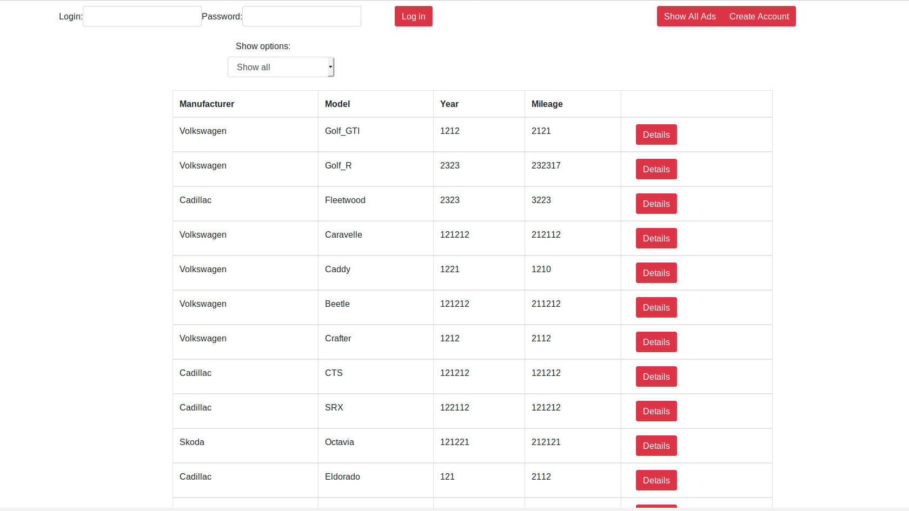
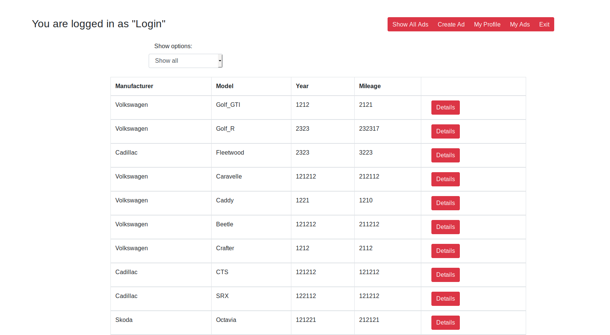
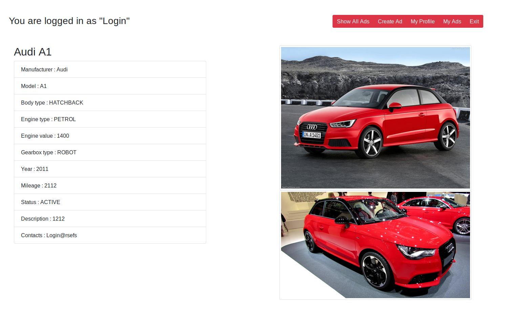
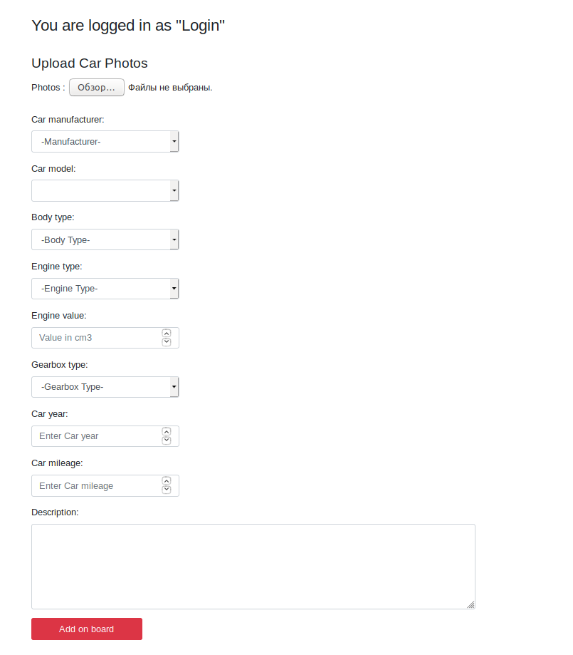
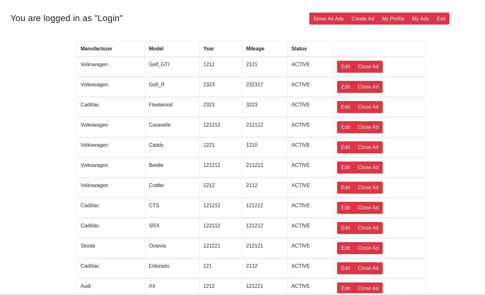
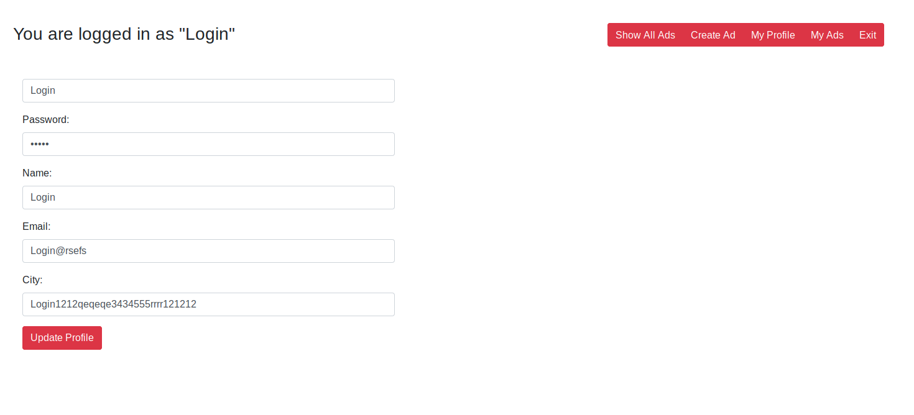
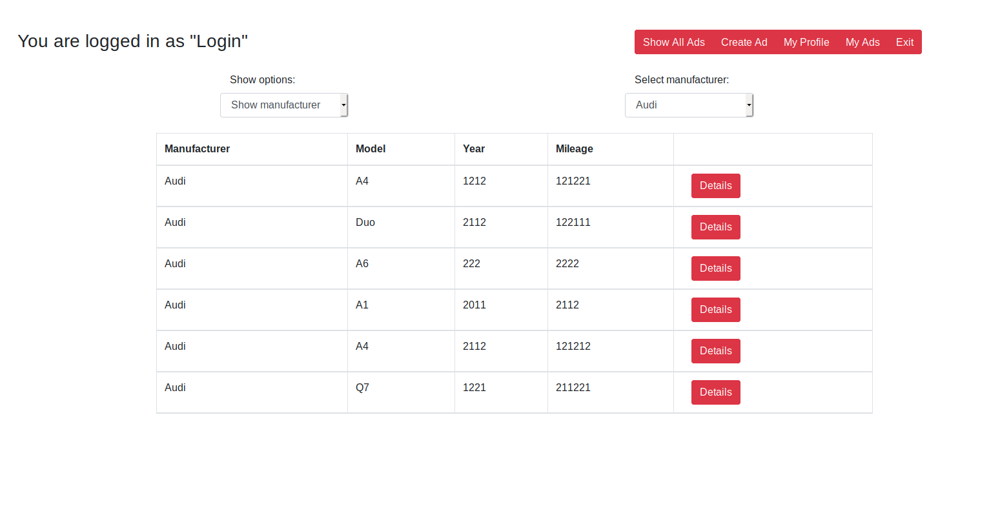
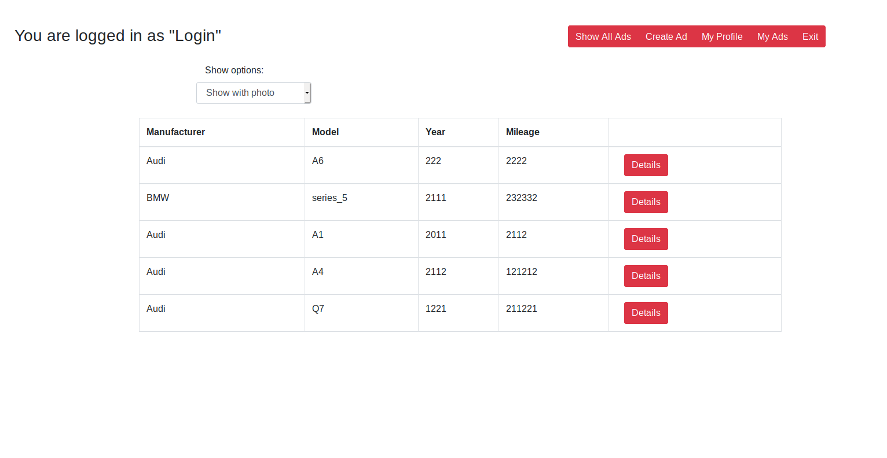
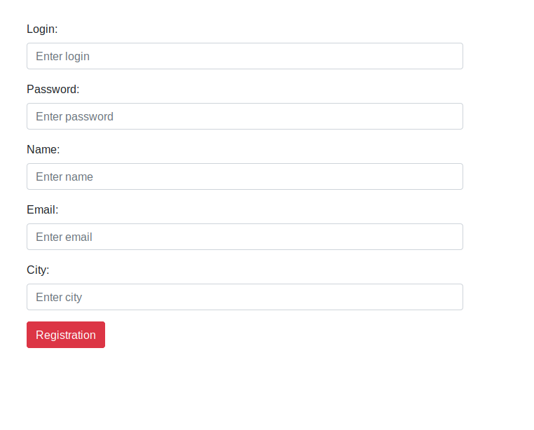

# Spring-Hibernate

В данном репозитории находится пример простого веб-приложения - сайт объявлений по продаже автомобилей. 

_Используется :_

- Java
- Spring (Boot, Data, MVC, IoC)
- PostgreSQL
- JSON + Jackson
- HTML, Bootstrap
- JavaScript, Ajax, JQuery

_Возможности приложения :_

Приложение предоставляет возможность регистрации пользователя, добавления и редактирования объявления, 
смену статуса объявления, входа в систему и выхода из нее. Зарегистрированные пользователи, объявления и автомобили
хранятся в отдельных таблицах БД. Приложение поддреживает добавление фотографии к объявлению. 
Фотографии также хрянятся в отдельной таблице БД в виде массива байтов. 
На главной странице реализованы фильтры показа объявлений (показать все, 
показать только с фото, показать за последний день, отфильтровать по марке авто).

- Главная страница приложения

- Главная страница приложения после авторизации пользователя

- Страница объявления

- Страница добавления объявления

- Страница с выводом всех объявлений пользователя. Можно изменять статус

- Страница редактирования профиля пользователя

- Фильтр объявлений по марке авто

- Фильтр показать только с фото

- Создание нового пользователя

_Установка и запуск :_

1. Загрузить с GitHub zip архив и распаковать его. Или склонировать 
репозиторий.
2. Запустить и посмотреть работу приложение можно в IDE Intellij IDEA.
3. Для запуска приложения стартовая страница находится по адресу
http://localhost:8080/index.html.

- сделать Security
- сделать добавление фото при редактировании объявления
- сделать удаление фото при редактировании объявления